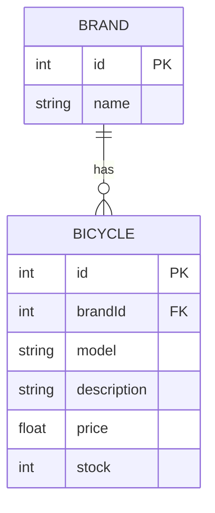
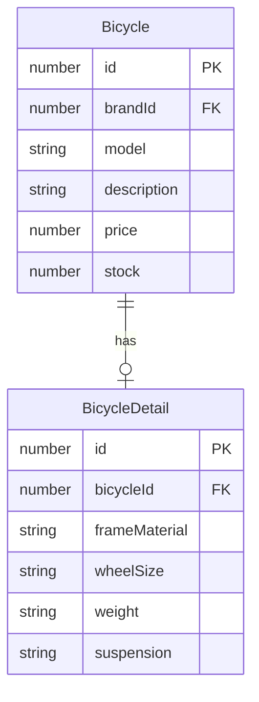

# Bicycle Shop

REST API for managing bicycles and brands.

## About the Project

The API allows you to:

* Create, view, update and delete bicycles.
* Create, view, update and delete brands.
* Store the information in a MySQL database.

## Technologies

* **Node.js**
* **TypeScript**
* **Express**
* **Sequelize**
* **MySQL**
* **Postman**

## Project Structure

```text
BICYCLES-SHOP/
├── backend/
│   ├── src/
│   │   ├── config/
│   │   ├── modules/
│   │   ├── routes/
│   │   ├── app.ts
│   │   └── server.ts
│   ├── package.json
│   └── tsconfig.json
└── postman/
```

## Installation

### 1. Clone the repository

```bash
git clone https://github.com/Kacper-1900/BICYCLES-SHOP-2.git
```

### 2. Enter the backend folder

```bash
cd backend
```

### 3. Install dependencies

```bash
npm install
```

### 4. Configure the database

Create a MySQL database and configure the `.env` file with your database information.

### 5. Start the project

```bash
npm run dev
```

The API will be available at:

```text
http://localhost:3000
```

## API Endpoints

### Bicycles

| Method | Endpoint            | Description      |
| ------ | ------------------- | ---------------- |
| GET    | `/api/bicycles`     | Get all bicycles |
| GET    | `/api/bicycles/:id` | Get a bicycle    |
| POST   | `/api/bicycles`     | Create a bicycle |
| PUT    | `/api/bicycles/:id` | Update a bicycle |
| DELETE | `/api/bicycles/:id` | Delete a bicycle |

### Brands

| Method | Endpoint          | Description    |
| ------ | ----------------- | -------------- |
| GET    | `/api/brands`     | Get all brands |
| GET    | `/api/brands/:id` | Get a brand    |
| POST   | `/api/brands`     | Create a brand |
| PUT    | `/api/brands/:id` | Update a brand |
| DELETE | `/api/brands/:id` | Delete a brand |

### SQL RELATION

1:N Relation



1:1 Relation



## Example

Create a bicycle:

```json
{
  "brand": "Orbea",
  "model": "Sky",
  "description": "Mountain bike",
  "price": 189.99,
  "stock": 5
}
```

## Testing

The API can be tested using **Postman**.

Postman link for testing: https://documenter.getpostman.com/view/58320217/2sBYB4L76N

## Author

**Kacper Jasinski**
